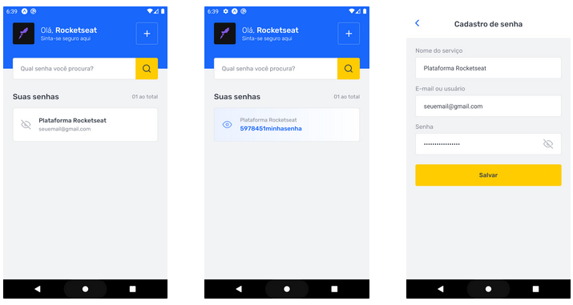

# SavePass

Personal password management application using React Native developed in the Rocketseat Ignite course.
## Technologies

Technologies used to build the application

- [ReactNative](https://reactnative.dev/)
- [TypeScript](https://www.typescriptlang.org/)
- [Expo](https://expo.dev/)
- [StyledComponents](https://styled-components.com/docs/basics)
- [ReactNavigation](https://reactnavigation.org/)

## Screenshots

<div align="center" id="top"> 
  
</div>
<br/>
<br/>

```bash
# Clone this project
$ https://github.com/ewertonspezia/SavePass

# Access
$ cd SavePass

# Install dependencies
$ yarn

# Run the project
$ expo start

or

$ yarn start
$ yarn android | $ yarn ios
```
